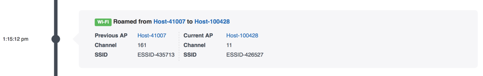

# Solving a Systemic Issue

###1. Click on the Reports Icon
The reports section of Voyance provides an overview of the systemic issues over the past week(s) that you should focus on, as well as an overview of the areas where you're doing well. 

You can click on the “Bottom” tab to see all of the bottom performing metrics in the Acme University environment. In order to proactively improve the client experience, you can drill into each of the areas of focus and figure out the next steps as shown in this guide.

Voyance also shows you a break-down of all of the metrics it measures by each location in your environment. You can view location specific trending information by clicking on “Location Rank” near the top of the page.

Clicking on the “Bottom” tab shows all of the bottom performing metrics by location. Clicking on a location takes you directly to a trending view of the selected metric in that particular location.

###2. Pick an Areas of Focus
Clicking on a metric takes you to a detailed view of how your environment is trending over time for a particular metric. For example, we can see that clients in Acme University are bouncing between SSIDs. You can click on the help icon (?) to see the meaning of this metric – i.e., it is a measure of clients that are switching back and forth between SSIDs over a very short period. A client roams excessively if there is a signal deficiency in the client's location or if there is an issue with client's wireless driver. Clicking on it, we see a baseline trend of % clients bouncing between SSIDs over the last 2 weeks across all locations / buildings. 

We see that approx. 6% of clients (16 out of 267) experienced this issue in the last 2 weeks, averaged across 24 hours in 1 hour increments. Scrolling further down on this page, you will see the most affected locations within your environment. Here the location named “AP-Group-382865” seems to have the most number of affected clients (31%). 

You can also see the actual clients that were affected and the number of hours they were impacted. From this summary, you can quickly jump to a location or a client and focus on fixing the issues causing problems within the specific location or a client. Scrolling further down, you will also see details on client properties, the most common root causes that were detected by Voyance, and the suggested next steps. 

###3. Check Most Affected Locations
Clicking on one of the most affected locations will take you to a detailed trend of the baseline for that location over the same timeframe. Here we see that on average, close to 30% of clients experience this issue in the selected location – AP-Group-382865. This is significantly higher than the average number of clients that experience this issue in the overall site (~6%).

We can further confirm that this location is one of the worst performers, when it comes to clients bouncing between SSIDs by looking at the comparison chart in which, Voyance compares this location to other similar locations within the environment.

###4. Check the Symptoms
Scrolling to the bottom of the page, we see a summary of the root-cause analysis, together with next steps to resolve the issue and common client properties found by Voyance in the selected location. Note that the symptom and the SSIDs are the same as the ones we found in the overall site.

###5. Check Affected Client(s)
Clicking on one of the affected clients, either in the overall site view or in the most affected locations view will take you to a detailed client page with more information on the issues experienced by the client. In the current example, we see that the clients seem to be bouncing between ESSID-426527 and ESSID-435713. Let’s take a closer look at these issues.

First, clicking on “View Timeline” will open up a timeline view of the client’s network interactions. At around 1:15pm, we can clearly see that this particular client moved from ESSID-435713 to ESSID-426527 and then within 30 seconds or so roamed back from ESSID-426527 to ESSID-435713. We see this pattern repeating several times in the timeline of events for the client. 

The following table shows 6 SSID transitions for the client within a span of ~15 minutes, along with the associated AP names.

###6. Check Corresponding Infrastructure Elements
As a next step, you can check the RF neighborhood information for the above APs by clicking on each one of them and bringing up the charts section of the AP details page. Voyance shows you AP neighborhood data for each radio band (2.4Ghz and 5Ghz), as well as information on rogue APs (if any). One of the reasons for clients bouncing between SSIDs might be due to a significant overlap of RF channel coverage in the neighborhood. Looking at the neighborhood charts, along with the above set of SSID transition data should provide clues as to which APs need to be examined further for proper coverage.

Voyance detected these transitions and suggested the following next steps:
•	Check for the RF coverage pattern and ensure optimal coverage
•	Check for wireless driver updates, since this could also be a client driver issue.
In this example, the network access control profiles could also be encouraging clients to change SSIDs. Checking the detailed settings of network infrastructure (e.g. Clearpass/Cloudpath settings, etc.) will also be a good next step.

###7. Make Suggested Change, Annotate, Move onto the Next Affected Location
Once an issue in a location has been identified and fixed, you can annotate this change to track its effect on the baseline trend. If the changes made were positive, you will see the baseline trend downward, i.e., you will see fewer clients bouncing between SSIDs over time. You can move onto other locations that Voyance detected as experiencing this issue or even chose a different metric to improve. You can access the full list of most affected locations for each metric in the “Locations Rank” tab.

