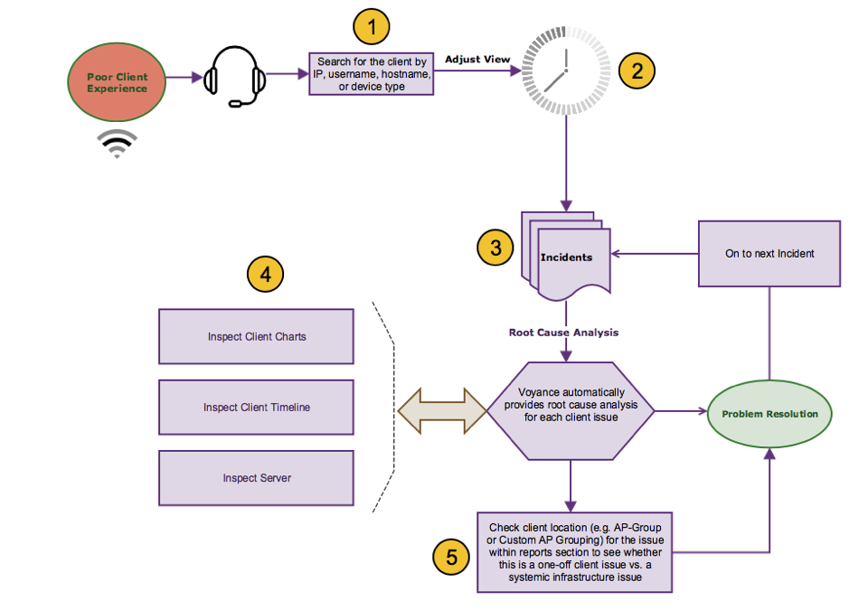
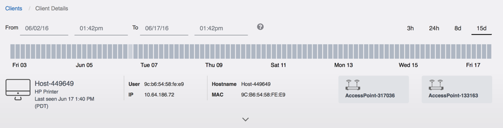
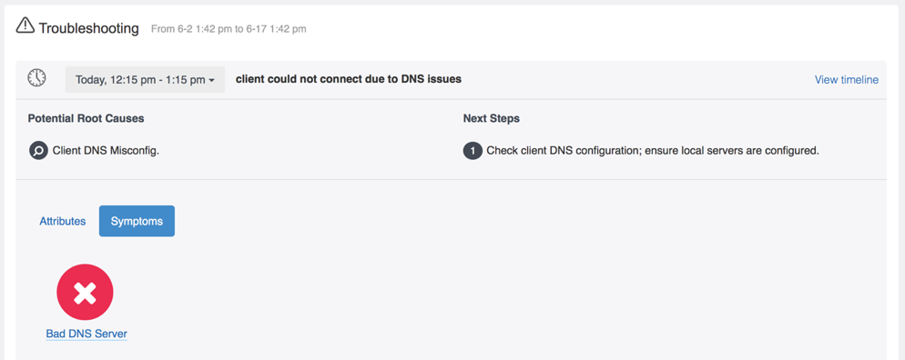
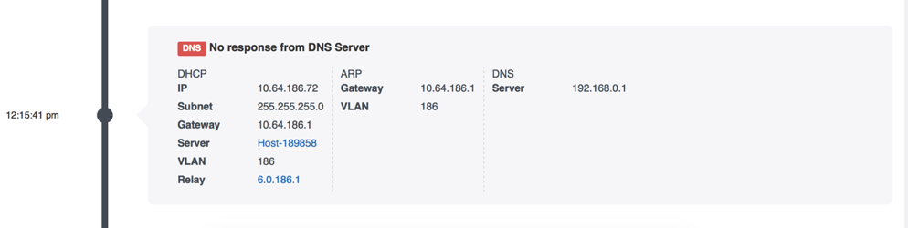

# Troubleshooting A Client Issue

###1. Search for a Client
Voyance comes integrated with a very powerful search tool, which lets you directly search for network elements that you are troubleshooting. You can search for the following entities:
•	A client by username, hostname, IP address, MAC address or by device type (e.g., Mac)
•	A server by hostname, IP address or by server type (e.g., RADIUS)
•	A VLAN by VLAN ID
•	Access Points by IP address, AP name or AP group name
•	Wireless Controllers by IP address
•	Applications by App name

###2. Adjust Timeline
Once in a client view, adjust the timeline to the reported incident time. If instead, you want to see all of the incidents that have occurred for a client, select the 15 day view on the top right corner of the page. The most recent details are shown for each incident type by default. 

###3. Check Incidents
Once a timeline is fixed, you will be able to see all of the incidents for the client. For each of the incidents, Voyance automatically provides root-cause analysis information and next steps.

In this particular case, Voyance identified that the client had issues connecting to the DNS server. The symptom that manifested in the client was that it did not get a response from the configured DNS server when it sent a request packet. Voyance automatically suggested the next steps – Check client DNS configuration.

###4. Verify the Symptoms
You can cross-check the raw data for a client by clicking on the chart and timeline views. 
Clicking on the event timeline, we see that the client associated with an AP, authenticated successfully, contacted the DHCP server and obtained an IP address (10.64.186.72), performed ARP request for the default gateway (10.64.186.1) and tried to contact the DNS server (192.168.0.1).

In this particular case, we see that the client device, which is an HP printer, was trying to access the DNS server that was not handed out by the DHCP server.
The above piece of evidence suggest that the problem is related to the client and adding the right DNS server IP to the client configuration should resolve the issue.
This is what you see summarized in the root-cause section of the product.

###5. Check if this is a Systemic Issue
For some incidents, it would also make sense to check whether the issue is a systemic issue or a one off issue with a particular client or infrastructure element. You can check for the client location (e.g. AP-Group or Custom AP Grouping) for this issue within the reports page and see how clients in this location are doing over time with respect to this metric (e.g., DNS). You can then identify all such clients that have misconfigured DNS servers and decide to fix them all at the same time.
