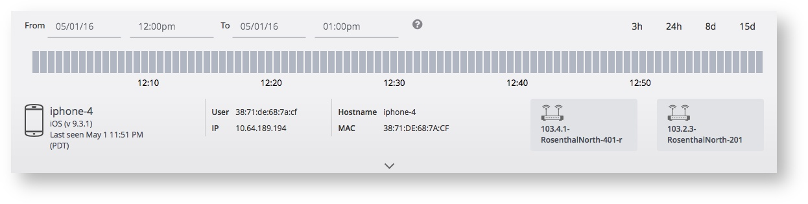
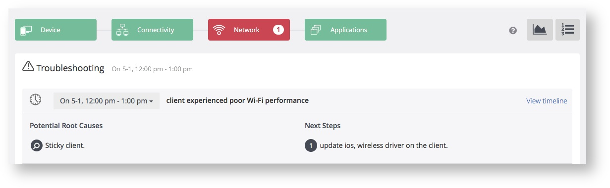
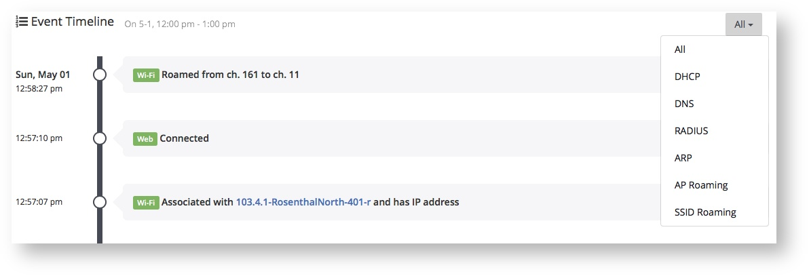
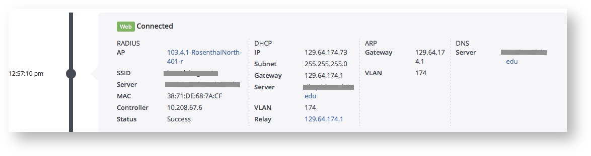

# Client Detail View
Voyance collects raw data on every single client in real-time - e.g., username, IP address, MAC address, VLAN ID, SSID and the AP that the client is connected to, the DHCP server being used, etc.

For troubleshooting purposes, you can also look at different time periods (up to 15 days) and see what the client details were at those times. Voyance displays a summary of the incidents that the client experienced in a selected timeframe, along with the most common root cause and remediation information for the symptoms that manifested in the client at the time. As in the overall incident details page, root causes and remediations for a client are in plain English.

Voyance tracks each client through all of the important connectivity phases  - from the time a client associates with an AP and authenticates to a RADIUS server, to the time it obtains an IP address from a DHCP server, ARPs for the gateway, contacts the DNS server and finally connects to the web. Clicking on the timeline icon on the top right will take you to a page with a timeline view of all of the raw data captured for the client over time (shown below). While troubleshooting an incident, clicking on the "View Timeline" link on the incident name (shown above) takes you right to the time in the event timeline when the incident occurred. You can also filter the timeline by selected events - e.g., DNS, DHCP etc.

You can further drill down into each of the events in the timeline by clicking on them. You will then see the raw data that was captured for the client when the event occurred.

