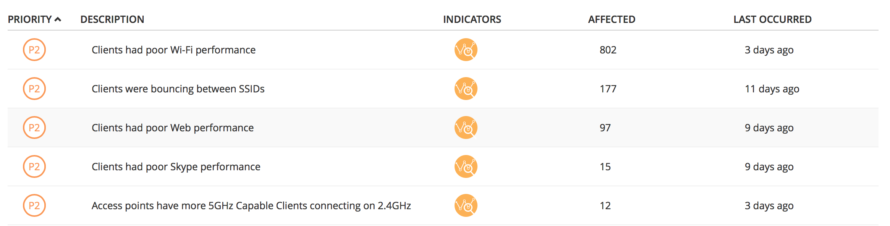
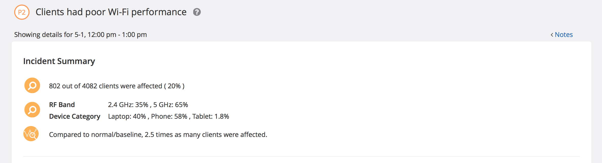
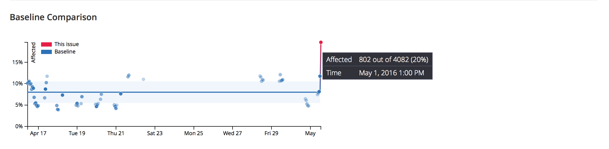
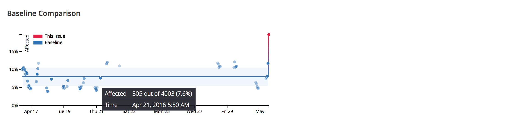
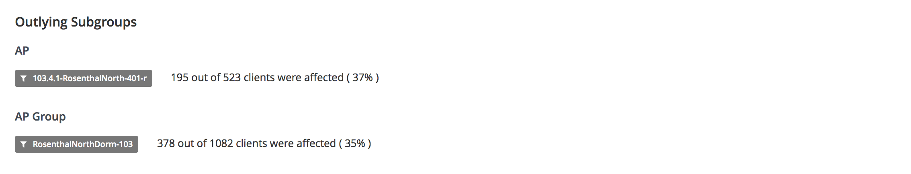
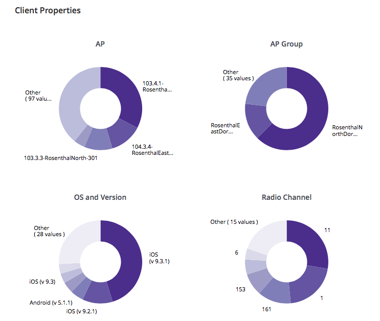
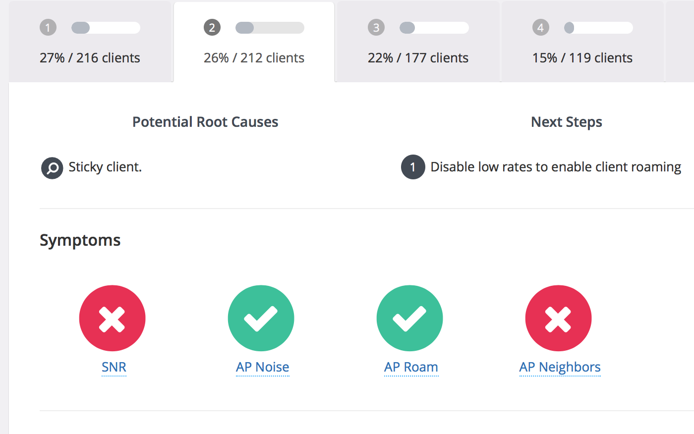

# Incidents

The incident details page provides a prioritized list of incidents in which the highest priority level issues surface to the top.
Incidents are worded in plain English - e.g., "Clients were bouncing between SSIDs" and displayed alongside the number of affected clients and when the incident last occurred. You can also further investigate localized issues by filtering incidents by a location, which displays affected clients in the selected location.

 
Clicking on an incident takes you to the incident details page, which displays a summary of why an incident was flagged with a certain priority, by showing the deviation from a computed baseline.  For example, clicking on the "Clients had poor Wi-Fi performance" incident shows that 20% of clients (802 out of 4082) experienced poor Wi-Fi performance between 12:00 pm and 1:00 pm on May 1st. You can also see a breakdown of the RF bands used by the clients connecting to Wi-Fi at this time interval, as well as the device categories (e.g., Phones, Laptops etc.)

The red line in the baseline chart shows the current deviation from the baseline.

In this particular example, we see that what is normal for the number of clients that experience poor Wi-Fi performance when approx. 4000 clients try to connect to Wi-Fi is 7.6% of clients. Hovering on the blue dots in the baseline chart shows these previously observed values for affected clients. Since the observed deviation was 2.5x compared to the baseline value in the specified time interval, the incident was marked with a P2 level of priority. Priority levels and alerts can be adjusted in the company settings page.

To help you narrow down the issue, Voyance shows specific locations in your environment that experienced this incident in the Outlying Subgroups section. Here you will see a breakdown by APs and AP groups. In this example, 195 clients connecting to the AP "103.4.1-RosenthalNorth-401-r" in the AP group "RosenthalNorthDorm-103" experienced poor Wi-Fi performance between 12:00 pm and 1:00 pm on May 1st. Depending on the incident, the other values could be OS and Version, Wired vs. Wireless, DHCP VLAN ID, DHCP Server, Radius Server, Controller IP, Radio Channel. 

We identify outlying subgroups based on two conditions: (1) number of affected clients > 5 and (2) the percentage of clients impacted is significantly > than overall percentage of clients impacted.

Scrolling further down, you will see the affected clients themselves.  You can click on a client to view more details of the client such as the AP(s) it was connected to, incidents faced by the client and potential root causes with remediation information for the issues seen. We will discuss the client detail page in the next section.

To further isolate the problem, Voyance also displays high level summaries of the clients attributes. In this example, a majority of clients were iOS devices, most of them running iOS v9.3.1. 

Voyance analyzes raw data from all of the clients and automatically identifies the most common symptoms that manifested in each set of clients. In addition to showing the symptoms, it provides root causes & remediations for each set of clients in plain English.
For example, in the picture below, out of the 802 clients that had poor Wi-Fi performance, Voyance identified 26% of clients experiencing SNR less than 25 dB and connecting to APs with more than 10 neighbors. Clicking on each of the symptoms displays the threshold values, along with the average raw value for the metric for the chosen set of clients.  

For example, clicking on the SNR symptom shows "On 5-1, between 12:00 pm - 1:00 pm, whenever clients had poor Wi-Fi performance, more than half the time the reported client's SNR was less than 25 dB."
Symptoms are calculated from the captured raw metrics that can be viewed by clicking on the chart or timeline view in the client detail page.

