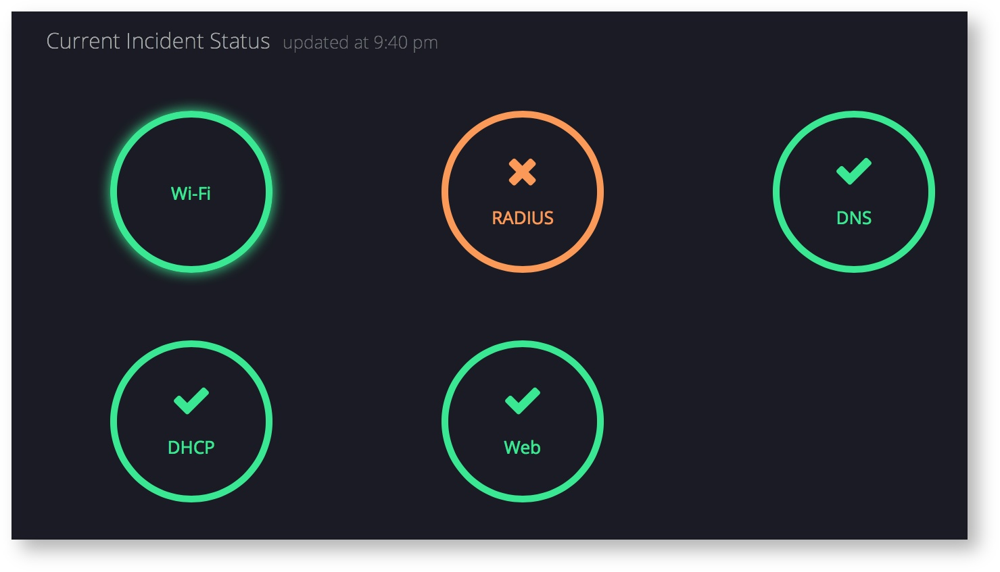
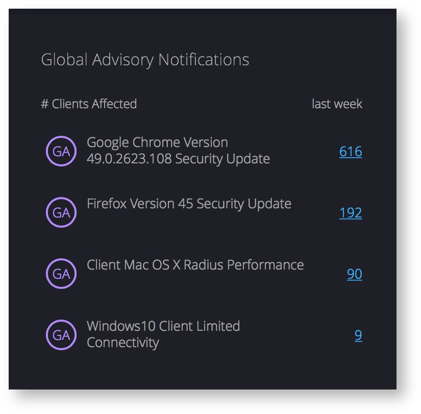
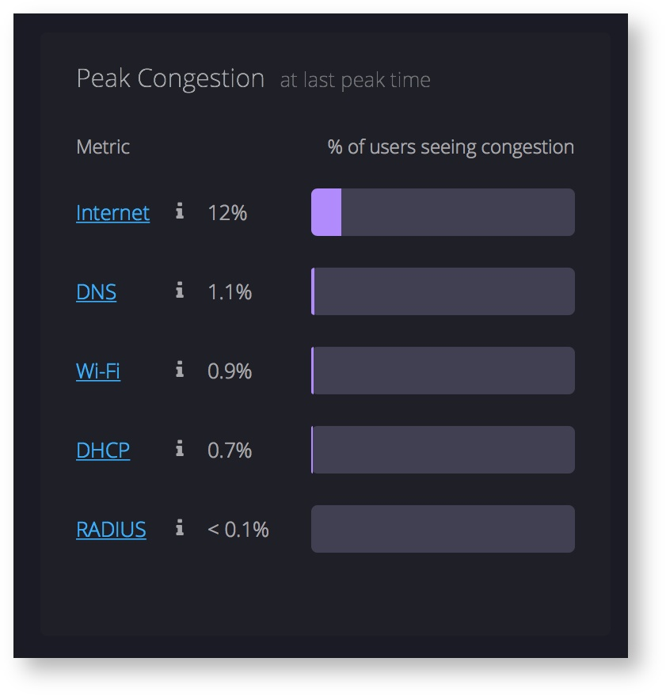
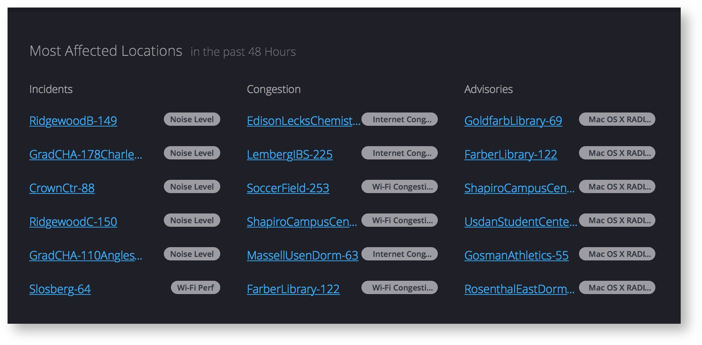

# Operations Dashboard
The operations dashboard is the first page you will see when you login to Voyance. It provides real-time situational awareness of network health.
The dashboard has four major sections and each one is described in greater detail in this document.
 
### Current Incident Status

This section shows the highest priority incidents related to Wi Fi, RADIUS, DNS, DHCP and Web issues.
P1 issues are shown in red
P2 issues are shown in yellow
P3  issues and below are shown in green
Hovering over circles shows the number of clients or infrastructure elements facing the issue. Clicking on the link takes you to an incident page with more details on the affected clients, the symptoms that manifested in those clients, along with the most common root cause and remediation information. Refer to the "Client Detail" section for more information.

###Global Advisory Notifications
In this section, you can track advisories that are relevant to your environment. Advisories can come from the vendors, e.g., a security update to the browser, or come directly from Voyance's analysis.

Also displayed with each advisory is the number of clients or infrastructure elements in your environment that are affected by the particular advisory in the last week. Clicking on the number displays a list of clients with relevant client information along with actionable next steps.

###Peak Congestion Metrics

Peak congestion is a snapshot view of whether you had enough capacity to handle your peak load. It shows when the last peak occurred and how many clients experienced poor performance for each of the different metrics such as Internet, DNS, Wi-Fi etc. Clicking on the link on each metric takes you to a detailed trending view, which you can customize by time period and a specific location (or AP group) within your environment.
Each metric has a different notion of congestion and capacity at peak usage:
Internet Congestion - shows the % of clients experiencing greater than average HTTP response times when Wi-Fi connectivity was good
DNS - shows the % of clients that tried to use DNS during peak time but experienced long average transaction times
Wi-Fi - shows the % of clients that tried to access wi-fi during peak time but connected to an AP radio with > 40% channel utilization
DHCP - shows the % of clients that tried to connect to a DHCP server during peak time but experienced long average transaction times
RADIUS - shows the % of clients that tried to connect to a DHCP server during peak time but experienced long average transaction times

###Most Affected Locations 

Even if things look ok from an incidents, congestion or advisories perspective overall, these problems are always localized.
This section shows localized problems at each of the defined locations and AP groups. You can get more details on the incident, congestion trend or advisories by clicking on a particular location. Voyance automatically recognized pre-defined AP groups out of the box. You can also define custom locations by selecting a set of APs or AP groups in the custom filters tab of the company settings page.

