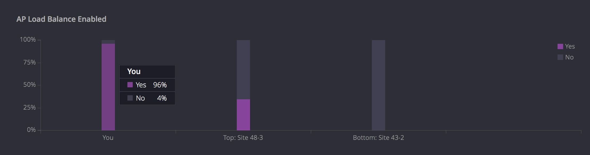

# Reports

While the operations dashboard provides a snapshot of the current health of the network, the reports page provides more insight into the long-term trends across various metrics. You can use this page to dig deeper into any of the metrics for any incident type. It helps answer questions such as:
How are the metrics in a given site or specific location trending over time? 
What effect did my change have on my network? Did it make things better or make things worse?
Is my performance in any given metric such as Wi-Fi performance considered good compared to similar environments using Voyance?
What are the other environments doing to improve the client's quality of experience?

###Baseline Experience

The chart above shows the baseline computed over time for Wi-Fi congestion in your overall environment. What it tells us is that over the last 2 weeks, at peak usage, an average of 0.6% of clients faced Wi-Fi congestion in your environment, i.e., 0.6% of clients connected to an AP radio with > 40% channel utilization. The chart is constructed from incident occurrences when the number of clients in the environment were close to the observed peak usage, which occurs when ~7700 clients connect simultaneously within a span of 1 hour. The blue points show representative (but not all) incident occurrences, with the darkness of the data point indicating how close the number of clients were to the reference point. Annotations can be revealed by hovering the mouse on a data point. 

It is important to note that while computing the baseline performance, client usage is held constant either at a ‘peak’ level, or at a specified level with a chosen number of clients. For example, select one of the non-congestion metrics from the baseline dropdown menu, say "Client DNS protocol/latency" metric as shown below. You can select the number of clients to compute the baseline over by clicking on the "Usage" drop-down menu on the top right hand corner of the baseline chart. If you select the 60%-tile (recommended), you will see the baseline performance when 60%-tile number of clients are connected simultaneously within a span of 1 hour. The system automatically skips quiet periods such as holidays or weekends, when the number of clients connecting does not meet the selected usage levels.

Baseline trend is available for all of the metrics that Voyance tracks - congestion metrics, connectivity and performance metrics, infrastructure related metrics and security metrics. Any metric can be chosen from the drop down menu at the top left corner of the baseline chart.

###Annotations
One of the fundamental questions Voyance helps answer is what effect did a particular change have on my network? Did it make things better or make things worse? To that end, you can use annotations to track network related changes and observe quantifiable effects on the baseline over time. Voyance supports both manual and automatic annotations on the baseline. As shown in the figure below, a manual annotation can be added by clicking on the "New Annotation" button. In this example, Voyance auto-detected a controller image change from 6.4.2.3 (old) to 6.4.2.16 (new) on April 21st at 10:18PM. Soon after the change was detected, the number of clients affected by the selected metric (Wi-Fi performance) went up by 0.1%. This is not something to be cautious of, but if the trend worsens over time due to the change, then necessary steps (e.g., rolling back the change) can be taken to address the issue. 

As of today, the following configuration changes on Aruba and Cisco APs and Controllers are automatically detected by Voyance:
* Band Select
* Client Match
* Load Balance
* TxPower Minimum
* TxPower Maximum
* WLAN Profile
* RF Profile
* Channel List
* Controller Image Change

###Industry Benchmarking
The next logical question that Voyance helps answer is how do you know whether your baseline performance is good or bad? Knowing the answer to this question can help focus your attention on things that need further improvement, rather than on things in which you are performing well. Voyance compares your environment to other similar environments and shows you how you fare in any given metric compared to your peers. In order to ensure a fair comparison, peers are chosen from the same vertical (e.g., enterprise) and have similar traffic profile (clients / week).

If you have multiple sites, you can compare a given site to other similar sites within your company by selecting "Internal Sites" from the drop down menu above this chart.
 
###Industry Comparison By Attributes
Once you know how you compare in any given metric, Voyance allows you to see important characteristics of other environments. Comparing your environment to the best performing ones can give you clues on what you can do to achieve better performance. For example, for Wireless congestion, have top environments enabled load balancing? What % of clients in other environments are 5G capable? What are the channel widths and AP models being used in top vs. bottom performing networks? 
All comparisons are from a client's perspective. For example, the chart below shows that 96% of clients in your environment are accessing APs that have load balancing enabled. Note that it is not showing the % of APs in your environment that have load balancing enabled.

###Most Affected Locations
While looking at congestion and other metrics for the overall site is important, it is also important to look at specific locations, as defined by AP groups or custom filters within your site, where the problems can be localized. At the bottom of the reports page, you will see a high level summary of the most impacted locations along with the most impacted clients within your environment. From this summary, you can quickly jump to a location or a client and focus on fixing the issues causing problems within the specific location or a client.

If you already know problem areas in your environment, you can also directly select a specific location from the drop down in the top part of the baseline chart and perform a similar analysis as outlined above. Voyance shows a comparison of the performance of a chosen location (e.g., building) with other locations within your site with respect to each metric. You can use this information to further narrow down problem areas within your environment.
